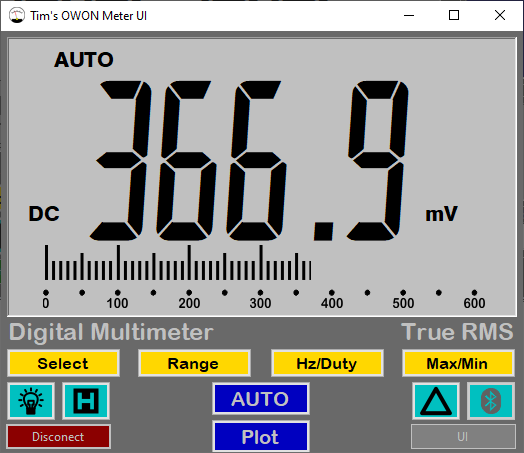

# OwonB41T
A Windows Bluetooth(BLE) client for the Owon B41T+ multimeter. Any BLE adaptor is compatible, so no dongle needed!  
Requires Windows 10  
I will be posting binaries in the future, but you should be able to compile this yourself if your Visual Studio environment is up to date.

## Now with New User Interface


## Current Features
This project is currently early in development, but I've completed the core functionality: 
* Compatibility with any Bluetooth Low Energy adapter (built-in ones included)
* Connecting to an Owon B41T+ by device name (GATT LocalName) or MAC address
* Printing data from the meter to stdout
* Controlling the meter with simulated button presses from stdin
* Sending non-button commands to the meter: start logging, download recorded data, rename device... etc.
  * Start offline data recording
  * Download and print recorded offline data
  * Renaming your device (the LocalName for your meter's advertisements)
## Features Coming Soon
* Retries for failed or dropped connections
* Command line argument option to connect by MAC address
* Command line argument parsing to make this a useful interface for use with other programs
* Output format customization
* Command line arguments for avoiding an interactive session (e.g. arguments to download recorded data to a file, start recording... etc.)


## Example Usage
If you haven't changed your multimeter's name, it should just connect automatically. Otherwise, you can pass the name (or a substring) of your multimeter as the first argument to the program.
```
$ ./x64/Release/OwonB41T.exe 2>/dev/null
0.0082  V AC    AUTO
0.0086  V AC    AUTO
0.0086  V AC    AUTO
0.0079  V AC    AUTO
```
After the meter is connected, you can interact with it using the following keys (for now, you must press return to send each keypress).
| Button | Key | 
| :------------- | :----------: |
| Hold/Backlight | h |
| Select | s |
| Range | r |
| Hz/Duty | z |
| Max/Min | m |
| Rel/BLE | d |

To simulate pressing and holding a key, use a capital letter instead, e.g. sending an 'H' turns on the backlight. 

## Offline Data Logging
Offline data support is in progress right now, so the interaction methods will certainly change.

### Downloading Recorded Data
Sending `o` to stdin (followed by a newline) will download the recorded data and print it to stdout:
```
typed: 'o'
Sending command: *READlen?
Will attempt to downlod 62 bytes
Sending command: *READ1?
downloading: 16.9492%
downloading: 33.8983%
downloading: 50.8475%
downloading: 67.7966%
downloading: 84.7458%
#       2021-02-04 20:26:18     13.62   m V AC
#       2021-02-04 20:26:19     13.69   m V AC
#       2021-02-04 20:26:20     13.43   m V AC
#       2021-02-04 20:26:21     13.84   m V AC
#       2021-02-04 20:26:22     13.55   m V AC
#       2021-02-04 20:26:23     13.96   m V AC
```

### Starting Offline Data Logging
Sending `p interval count` (where `interval` is an integer representing the number of seconds between data points and `count` is an integer representing the number of data points) to stdin (followed by a newline) will make the meter disconnect from Bluetooth and start recording.

Currently, there is no real feedback about it disconnecting. This will come in the future when I implement retry/reconnect functionality.

## Renaming the Meter
Sending an `@` followed by a new device name (then a newline) will rename your multimeter. The name is limited to 14 characters total and the string `B41T+` is currently appended to the end of your inputted name by default. This ensures the default search substring of `B41T` still finds your meter.  
This is just a quick solution, so this method of renaming is very likely to change in the future.  
Also, be careful of what characters you input for the name. I blocked all non-print characters and a handful of symbols to ensure nothing very weird can happen where the meter would become unrecognizable due to unknown issues with special characters.

---

## Notes
I have tested this software on three different computers and I haven't seen any compatibility  issues, but your mileage may vary. Please let me know if the releases don't run or the .sln does not compile.

The current methods of interacting with the meter will certainly be changed in the future. This is just what I slapped together while I was trying to get the more complicated bits working.

There is currently a bug where connecting to the meter will fail and hang in extremely rare circumstances. I have not tried figuring out the issue, as it is so difficult to replicate and happens so infrequently. Killing the program and restarting it resolves it.
